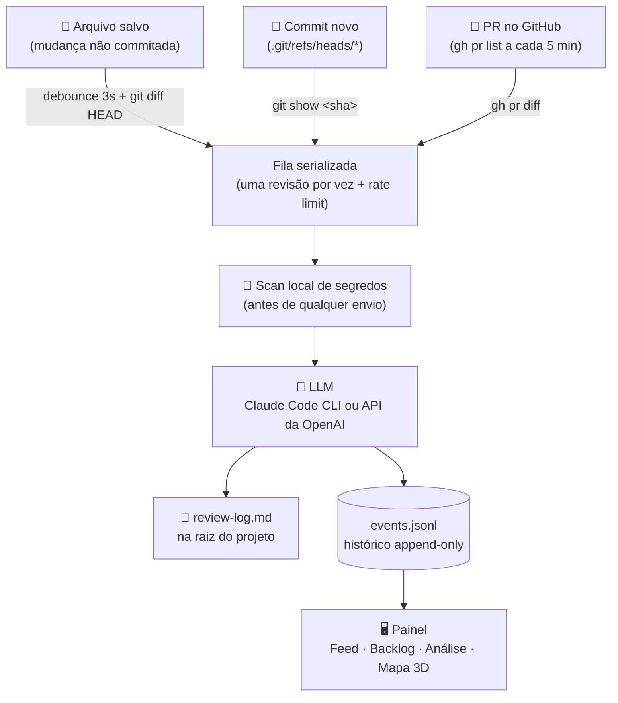
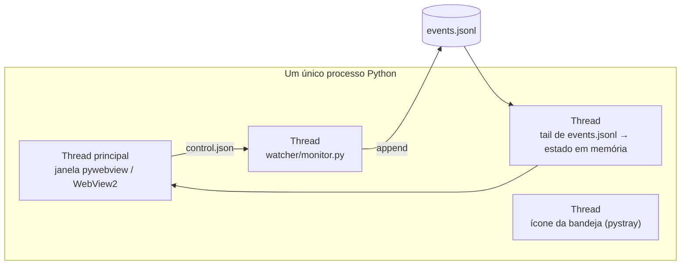

# Code Watcher

> Um "revisor de código" que fica de olho em **todos** os seus repositórios ao mesmo tempo.

Code Watcher é um app de bandeja para Windows que observa suas pastas de projeto em
background e, a cada mudança relevante — arquivo salvo, commit novo, PR aberto —,
manda o diff para um LLM revisar com foco em **bugs e riscos**. O resultado vai para
um `review-log.md` na raiz de cada projeto e aparece em tempo real num painel visual.

A ideia: em vez de você lembrar de revisar cada alteração espalhada por dezenas de
repositórios, um processo faz isso sozinho enquanto você trabalha em outra coisa.

<!-- Sugestão: adicione aqui um screenshot do painel (Feed) e um do Mapa 3D. -->

---

## Índice

- [Como funciona](#como-funciona)
- [O que o painel mostra](#o-que-o-painel-mostra)
- [Instalação](#instalação)
- [Uso](#uso)
- [Configuração](#configuração)
- [Arquitetura](#arquitetura)
- [Estrutura do repositório](#estrutura-do-repositório)
- [Desenvolvimento](#desenvolvimento)
- [Limitações conhecidas](#limitações-conhecidas)
- [Licença](#licença)

---

## Como funciona

Três fontes de alteração convergem no mesmo pipeline:



1. **Arquivo salvo com mudança não commitada** — espera ~3 s de silêncio
   (debounce, para não disparar a cada `Ctrl+S`), roda `git diff HEAD` e manda revisar.
2. **Commit novo** — o git escreve o hash em `.git/refs/heads/<branch>` a cada commit;
   o watcher já observa esse arquivo. Sem hooks, sem polling, só git local.
3. **PR aberto ou atualizado no GitHub** — uma thread separada consulta `gh pr list`
   a cada 5 minutos por repositório com remote do GitHub.
   **Somente leitura**: a revisão **nunca** é postada de volta no GitHub — fica só no
   `review-log.md` e no painel.

Antes de qualquer chamada ao LLM, um scan local procura **segredos vazados**
(chave de API em plaintext, token sem expiração, etc.). Esses achados aparecem
na hora, sem passar pelo modelo.

---

## O que o painel mostra

| Aba / recurso | Para quê |
|---|---|
| **Feed** | Revisões em tempo real, mais recentes no topo. Filtro por projeto, busca, "só críticas". |
| **Backlog** | Todo achado de severidade **alta** ou **média** vira um item acionável (resolver / dispensar / reabrir). |
| **Análise** | Dashboard de tendências: severidade ao longo do tempo, arquivos *hotspot*, custo de LLM por projeto, origem das alterações. |
| **Mapa 3D** | Visualização estilo *Git City* (three.js): cada projeto é um distrito, cada arquivo é um prédio, cada commit/PR é um bloco empilhado. Prédios com achado crítico ganham um marcador flutuante. |
| **Perguntar ao histórico** | Pergunta em linguagem natural sobre o `review-log` de um projeto ("quais problemas de segurança já foram flagados esse mês?"). |
| **Resumo diário / standup** | Gera um resumo do que mudou no período (hoje / ontem / 7 dias). |
| **Detectar padrões** | Analisa o backlog de todos os projetos e aponta achados que se repetem em mais de um. |

O ícone da bandeja muda de cor conforme o estado: **verde** monitorando ·
**âmbar** revisando · **cinza** pausado.

---

## Instalação

### Requisitos

- **Windows** — a bandeja e a janela usam APIs do Windows (WebView2 + Win32).
- **Python 3.11+** (testado em 3.14).
- **git** no `PATH`.
- Um provedor de LLM, à sua escolha:
  - [Claude Code CLI](https://docs.claude.com/claude-code) no `PATH` (`claude`), **ou**
  - uma **chave da API da OpenAI** (configurada pelo painel).
- *Opcional, só para a fonte de PR:* [GitHub CLI](https://cli.github.com/) (`gh`)
  instalado e autenticado (`gh auth login`). Sem isso, as duas outras fontes
  continuam funcionando normalmente.

### Passos

```powershell
git clone https://github.com/ndmg-dev/CodeWatcher.git
cd CodeWatcher

pip install -r requirements.txt        # watchdog, pystray, pywebview, Pillow

# escolha um provedor de LLM:
npm install -g @anthropic-ai/claude-code   # opção A: Claude Code CLI
#   opção B: nada a instalar — cole a chave da OpenAI no painel, em Configurações

# opcional, para revisar PRs:
winget install --id GitHub.cli
gh auth login
```

---

## Uso

### App completo (bandeja + painel)

```powershell
pythonw watcher_gui.py          # sobe só na bandeja
pythonw watcher_gui.py --show   # sobe e já abre o painel
```

- O **`X`** da janela **esconde** o painel, não encerra. Para encerrar: botão
  direito no ícone → **Sair**.
- O Windows 11 esconde ícones novos atrás do `^` — arraste o ícone verde para a
  barra de tarefas para fixá-lo e não perder o feedback de estado.

### Só o motor, no terminal (sem GUI)

```powershell
python code_watcher.py
```

Lê o mesmo `projects.json` e faz as mesmas revisões. A GUI é opcional.

### Executável

```powershell
./build_exe.ps1        # gera dist/CodeWatcher.exe (PyInstaller --onefile --windowed)
```

---

## Configuração

### Pastas monitoradas — pelo painel

- **+ Adicionar pasta** — seletor nativo; valida que é um repositório git e
  reinicia o watcher.
- **🔍 Buscar repositórios** — escolha uma pasta **raiz** (ex.: `C:\Projetos`) e o
  app varre recursivamente atrás de subpastas com `.git`, ignorando
  `node_modules`, `venv`, etc. e sem descer dentro de um repo já encontrado.
- **Remover** — passe o mouse sobre a pasta e clique no `×`. Não apaga nada do
  disco; o `review-log.md` continua lá.
- **Clicar no nome** de uma pasta pausa/retoma só ela.

### Ajustes finos — `watcher/config.py`

Constantes no topo do arquivo:

| Constante | Padrão | O que faz |
|---|---|---|
| `CODE_EXTENSIONS` | 25 extensões | Quais arquivos disparam revisão |
| `IGNORED_DIRS` | `node_modules`, `.git`, `venv`, … | Pastas ignoradas em qualquer nível |
| `DEBOUNCE_SECONDS` | `3.0` | Silêncio antes de disparar após um `Ctrl+S` |
| `MAX_DIFF_CHARS` | `12000` | Limite do diff enviado ao LLM |
| `PROMPT_TEMPLATE*` | — | Os prompts de revisão (arquivo / commit / PR) |
| `PR_POLL_SECONDS` | `300` | Intervalo entre checagens de PR por repositório |
| `DEFAULT_MAX_REVIEWS_PER_HOUR` | `30` | Teto de chamadas ao LLM por hora (editável no painel) |
| `EVENTS_MAX_BYTES` | `5 MB` | Tamanho do `events.jsonl` que dispara rotação |

Provedor de LLM, chave da OpenAI, modelo, teto de revisões/hora e gatilho de
notificação são editáveis pelo painel (**⚙️ Configurações**) e gravados em
`control.json`.

---

## Arquitetura

Quatro decisões que moldam o projeto:

### 1. Um processo, várias threads



A GUI e o motor de revisão rodam no **mesmo processo**, em threads. (Até 2026-08
o motor era um subprocesso amarrado a um Job Object do Windows — virou thread
para funcionar dentro do `.exe` empacotado com `--onefile`.)

### 2. Comunicação por arquivos, não por sockets

- **GUI → motor:** `control.json` (estado de pausa). O motor relê a cada revisão.
- **motor → GUI:** `events.jsonl`, uma linha JSON por evento. A GUI faz *tail*.

Sem portas, sem servidor. Sobrevive ao reinício de qualquer um dos lados e dá o
histórico de graça.

### 3. Event sourcing num arquivo de texto

Não há banco de dados. A **fonte da verdade** é o `events.jsonl` — cada revisão,
achado e custo é um evento *append-only*. No boot, o app relê o arquivo inteiro e
**reconstrói o estado em memória** (`WatcherState`). Fácil de inspecionar (`cat`),
trivial de versionar, sem "schema para migrar". Acima de 5 MB o arquivo rotaciona,
guardando as linhas recentes e um resumo agregado do que saiu.

Eventos: `started` · `review_start` · `review_done` · `review_failed` ·
`secret_found` · `history_query` · `stopped`.

### 4. Offline-first

A UI inteira é **um `ui.html`** — HTML/CSS/JS puro, sem framework, sem build step.
Nada de CDN nem Google Fonts: um `<link>` externo já travou a janela inteira uma
vez, com o WebView2 preso esperando a fonte carregar. A única exceção é a aba
**Mapa 3D**, que carrega o three.js sob demanda na primeira vez que é aberta —
nunca no boot.

O único ponto que precisa de rede é a chamada ao LLM.

### Arquivos de estado

Ficam **fora** das pastas de projeto, em `%LOCALAPPDATA%\CodeWatcher\`:
`events.jsonl`, `control.json`, `projects.json`, `seen_commits.json`,
`seen_prs.json`, `backlog_status.json`, `watcher.log`.

---

## Estrutura do repositório

| Caminho | Papel |
|---|---|
| `watcher_gui.py` | Ponto de entrada da GUI (`watcher.gui.app.run_gui`). |
| `code_watcher.py` | Ponto de entrada do motor, sem GUI (`watcher.monitor.main`). |
| `ui.html` | A interface inteira — HTML/CSS/JS, consumida via `window.pywebview.api.*`. |
| `watcher/monitor.py` | Loop do watchdog, debounce, fila, rate limit. |
| `watcher/review.py` | Pipeline de revisão (diff → LLM → log → evento). |
| `watcher/llm.py` | Abstração do provedor (Claude CLI / OpenAI). |
| `watcher/git.py` | Helpers de git e descoberta de repositórios. |
| `watcher/secrets.py` | Scan local de segredos. |
| `watcher/ask.py`, `summary.py`, `patterns.py` | Recursos sob demanda (perguntar / resumo / padrões). |
| `watcher/config.py` | Constantes e caminhos de estado. |
| `watcher/gui/app.py` | Janela pywebview, ponte JS↔Python, ciclo de vida. |
| `watcher/gui/state.py` | `WatcherState` — reconstrói o estado a partir do `events.jsonl`. |
| `watcher/gui/tray.py` | Ícone e menu da bandeja. |
| `docs/code-watcher.md` | Documentação técnica detalhada, com histórico de decisões. |
| `build_exe.ps1`, `make_icon.py` | Empacotamento e geração do ícone. |

---

## Desenvolvimento

```powershell
./smoke_test.ps1        # checagem rápida do fluxo do watcher
```

Docs técnicas completas — arquitetura, decisões, incidentes e testes — em
[`docs/code-watcher.md`](docs/code-watcher.md).

Contribuições são bem-vindas. Ao mexer no `ui.html`, lembre: **sem dependências
externas carregadas de forma síncrona** (ver [Offline-first](#4-offline-first)).

---

## Limitações conhecidas

- **Windows apenas** — a bandeja e a janela dependem de WebView2 + Win32.
- **Revisão de PR é somente leitura** — decisão deliberada; nada é postado no GitHub.
- O painel mantém em memória as ~60 revisões mais recentes; o histórico completo
  fica no `review-log.md` de cada projeto e no `events.jsonl`.
- A qualidade da revisão é a qualidade do LLM configurado.

---

## Licença

Defina uma licença antes de publicar (ex.: adicione um arquivo `LICENSE` com a
MIT). Sem `LICENSE`, o padrão é "todos os direitos reservados".
